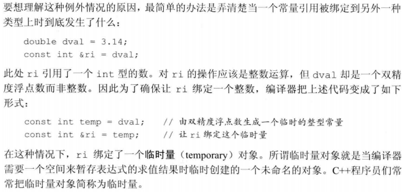

# 2.4 const限定符

+ const对象创建后其值不能改变，所以const对象必须初始化，初始值可以是任意复杂的表达式

+ 默认状态下，const对象只在文件内有效，不能多个文件共享，如果想在多个文件之间共享const对象，须在变量定义之前添加extern关键字

## 2.4.1 const的引用
+ **const的引用**：若引用绑定在const对象上，则称之为对常量的引用，对常量的引用不能被用作修改它所绑定的值
  > `const int ci = 1024;`  
  > `const int &r1 = ci;`  //正确：引用及其对应的对象都是常量  
  > `r1 = 42;`  //错误：r1是对常量的引用  
  > `int &r2 = ci;`  //错误：试图让一个非常量引用指向一个常量对象

+ 引用的类型必须与其所引用对象的类型一致，但是有两个例外：
  1. 初始化常量引用时允许用任意表达式作为初始值，只要该表达式的结果能转换成引用的类型即可，尤其，允许为一个常量引用绑定非常量的对象、字面值，甚至是一般表达式
   > `int i = 41;`  
   > `const int &r1 = i;`  //允许将`const int&`绑定到一个普通int对象上  
   > `const int &r2  = 42;`  //正确：r1是一个常量引用  
   > `const int &r3 = r1 * 2;`  //正确：r2是一个常量引用  
   > `int &r4 = r1 * 2;`  //错误：r4是一个普通的非常量引用

+ 常量引用仅对引用可参与的操作做出了限定，对引用的对象本身是不是一个常量未作限定，因为对象也可能是个非常量，所以允许通过其他途径改变它的值

## 2.4.2 指针和const
+ **指向常量的指针**不能用于改变其所指向对象的值，只能用指向常量的指针存放常量对象的地址
  > `const double pi = 3.14;`  
  > `double *ptr = &pi;`  //错误：ptr是一个普通指针，不能存放常量对象的地址  
  > `const double *cptr = &pi;`  //正确  
  > `*cptr = 42;`  //错误：不能给`*ptr`赋值  
  > `double dval = 3.14;`  
  > `cptr = &dval;`  //正确：但是不能通过cptr改变dval的值，但可以通过其他途径改变

+ **常量指针**必须初始化，一旦初始化完成，它的值（即存放在指针中的那个地址）就不能再改变，把*放在`const`关键字之前用以说明指针是一个常量（不变的是指针本身的值）
  > `int errNumb = 0;`  
  > `int *const curErr = &errNumb;`  //curErr将一直指向errNumb  
  > 要想弄清楚这些声明的含义，最有效的方法是从右向左阅读，如上例中离curErr最近的符号是`const`，意味着curErr本身是一个常量对象，*意味着curErr是一个常量指针，最后，基本数据类型部分确定了常量指针指向的是一个int对象。

## 2.4.3 顶层const
+ 顶层const表示指针本身是一个常量（任意对象是常量），底层const表示指针所指的对象是一个常量
  > `int i = 0;`  
  > `int *const p1 = &i;`  //不能改变p1的值，这是一个顶层const  
  > `const int ci = 42;`  //不能改变ci的值，这是一个顶层const  
  > `const int *p2 = &ci`  //允许改变p2的值，这是一个底层const  
  > `const int *const p3 = p2;`  //右侧const是顶层const，左侧const是底层const
  > `const int &r = ci;`  //用于声明引用的const都是底层const

+ 当执行对象的拷贝操作时，常量是顶层const还是底层const区别明显
  1. 顶层const不受影响
     > `i = ci;`  //正确：拷贝ci的值，ci是一个顶层const，对此操作无影响  
     > `p2 = p3;`  //正确：p2和p3指向的对象类型相同，p3顶层const的部分不影响
  2. 拷入和拷出的对象必须具有相同的底层const，或两个对象的数据类型能够转换，一般来说，非常量可以转换成常量，反之不行
     > `int *p = p3;`  //错误：p3包含底层const的定义，而p没有（常量不可转换成非常量）  
     > `p2 = p3;`  //p2和p3都是底层const  
     > `p2 = &i;`  //正确：int* 能够转换成const int*  
     > `int &r = ci;`  //错误：普通的int&不能绑定到int常量上  
     > `const int &r2 = i;`  //正确const int&可以绑定到一个普通int上

## 2.4.4 constexpr和常量表达式
+ **常量表达式**：值不会改变并且在编译过程就能得到计算结果的表达式（字面值属于常量表达式，用常量表达式初始化的const对象也是常量表达式）
  > `const int max_files = 20;`  //max_files是常量表达式  
  > `const int limit = max_files + 1;`  //limit是常量表达式  
  > `int staff_size = 27;`  //staff_size不是常量表达式  
  > `const int sz = get_size();`  //sz不是常量表达式，具体值运行时才能获取到

+ c++11新标准规定，允许将变量声明为constexpr类型以便由编译器来验证变量的值是否是一个常量表达式，声明为constexpr的变量一定是一个常量，且必须用常量表达式初始化
  > `constexpr int mf = 20;`  //20是常量表达式，正确声明  
  > `constexpr int limit = mf + 1;`  //mf + 1是常量表达式，正确声明  
  > `constexpr int sz = size();`  //只有当size是一个constexpr函数时才是一条正确的声明语句(新标准定义一种特殊的constexpr函数，这种函数应足够简单以使得编译时就可计算其结果)

+ 一般来说，如果认定变量是一个常量表达式，那就把它声明为constexpr类型

+ **字面值类型**：常量表达式的值需要在编译时就得到计算，因此对声明constexpr时用到的类型需要有所限制，这些类型一般比较简单，值显而易见、容易得到，把它们成为“字面值类型”

+ 算数类型、引用和指针都属于字面值类型，自定义类、IO库、string类型则不属于字面值类型，也就不能被定义成constexpr

+ 尽管指针和引用都能定义成constexpr，但它们的初始值却受到严格限制，一个constexpr指针的初始值必须是nullptr或0，或是存储于某个固定地址中的对象

+ 在constexpr声明中如果定义了一个指针，限定符constexpr仅对指针有效，与指针所指的对象无关
  > `const int *p = nullptr;`  //p是一个指向**整型常量**的指针  
  > `constexpr int *q = nulptr;`  //q是一个指向整型的**常量指针**