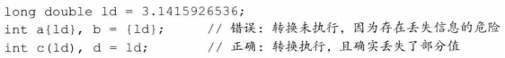
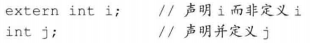
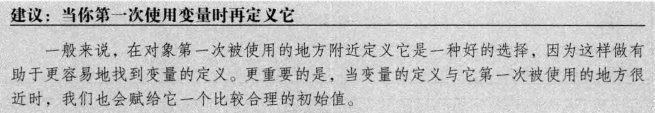

# 2.2 变量

## 2.2.1 变量定义
+ 初始化不是赋值，初始化的含义是创建变量时赋予其一个初始值，而赋值的含义是把对象的当前值擦除，以一个新值替代

+ **列表初始化**：用花括号来初始化变量，形如 int  units_sold{0}
  > 这种初始化有一个重要的特点：当对内置类型使用列表初始化且初始值存在丢失信息的风险，编译器将报错

+ **默认初始化**：如果定义变量时没有指定初值，则变量被默认初始化
  1. 内置类型变量未被显示初始化，当其定义于任何函数体之外其被初始化为0，而定义于函数体内部的内置变量类型将*不被初始化*，其值是未定义的，如果试图拷贝或以其他形式访问此类值将引发错误
  2. 类类型的变量自定义其初始化对象的方式，是否允许不经初始化就定义对象也由类自己决定

## 2.2.2 变量声明与变量定义的关系
+ 为了支持*分离式编译*，C++将声明和定义区分开来，**声明**使得名字为程序所知，一个文件若想使用别处定义的名字则必须包含对那个名字的声明；**定义**负责创建与名字关联的实体
  > 变量声明规定了变量的类型和名字，这一点变量定义与之相同，除此之外，变量定义还申请存储空间，也可能会为变量赋一个初始值；如果想声明一个变量而非定义它，就在变量名前加上关键字`extern`，且不要显示地初始化变量，任何包含了显示初始化的声明即成为定义

+ 函数体内部可以声明并且使用extern标记的变量，但是如果在函数体内定义一个extern变量，那么由于函数体内变量作用域仅限于函数体内的原因，将会导致出错

## 2.2.3 标识符
+ 由字母、数字和下划线组成，必须以字母或下划线开头，长度没有限制，对大小写敏感
  1. 标识符要能体现实际含义
  2. 变量名一般用小写字母
  3. 用户自定义的类名一般以大写字母开头，如Sales_item
  4. 若标识符由多个单词组成，单词间应该有明显区分，如student_loan或studentLoan

## 2.2.4 名字的作用域
+ 同一个名字在不同作用域可能指向不同的实体，名字的有效区域始于名字的声明语句，结束于声明语句所在作用域末端

+ 作用域可以彼此包含，作用域中一旦声明了某名字，它所嵌套的所有作用域中都能访问该名字

+ 如果函数有可能用到某全局变量，则不宜再定义一个同名的局部变量