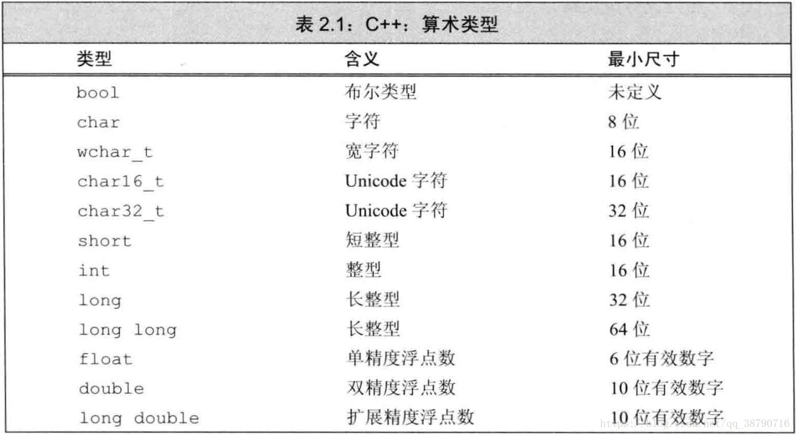
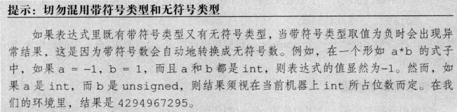
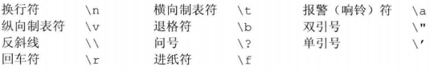
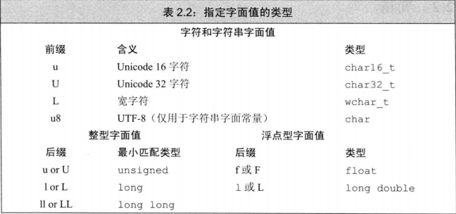

# 2.1 基本内置类型

+ 算数类型（字符、整型数、布尔值、浮点数）和 空类型
## 2.1.1 算数类型
+ 分两类：整形和浮点型

+ c++语言规定一个int至少和一个short一样大，一个long long至少和一个long一样大。其中数据类型long long实在c++11中新定义的

+ 在带符号类型名前添加unsigned就能得到无符号类型

+ 如何选择类型：
  1. 当明确知晓数值不可能为负时，选用无符号类型
  2. 使用int执行整数运算，short常常显得太小而long一般和int有一样的尺寸，如果数值超过int范围，选用long long
  3. 在算术表达式中不要使用char或bool，因为char在一些机器上是有符号的，而在另一些机器上却是无符号的，若需要使用一个不大的数，明确指定其为singed char或unsinged char
  4. 执行浮点数运算选用double，因为float通常精度不够且双精度浮点数和单精度浮点数的计算代价相差无几

## 2.1.2 类型转换
+ 把浮点类型赋给整型，仅保留小数点之前的部分

+ 赋给无符号类型一个超出其表示范围的值时，结果是初始值对无符号类型表示数值总数取模后的余数，8比特大小的unsigned char 可以表示0至255区间内的值，如果我们赋了一个区间以外的值，则实际的结果是该值对256取模后所得的余数。因此，把-1赋給8比特大小的unsigned char 所得的结果是255

+ 赋給带符号类型一个超出它表示范围的值时，结果是未定义的（undefined）。此时，程序可能继续工作、可能崩溃，也可能生成垃圾数据

+ 当表达式中既出现无符号数又有int值时，int值会转换成无符号数
  > `unsigned u = 10;`  
  > `int i = -42;`  
  > `cout << i + i << endl;`  //输出-84  
  > `cout << i + u << endl;`  //如果int占32位，输出4294967264

+ 从无符号数减去一个值，无论该值是不是无符号数，都要确保不能为负值
  > `unsigned u1 = 42, u2 = 10;`  
  > `cout << u1 - u2 << endl;`  //输出32  
  > `cout << u2 - u1 << endl;`  //结果是取模后的值

+ 当使用无符号数作为循环变量时，注意循环控制条件(无符号数不会小于0)

## 2.1.3 字面值常量
+ 每个字面值常量都对应一种数据类型，字面值常量的形式和值决定了它的数据类型
  1. 整型和浮点型字面值：形如42（整型字面值），3.141519（浮点型字面值）
  2. 字符和字符串字面值：形如'a'（字符字面值），"hello world"（字符串字面值实际上是由常量字符构成的数组，编译器在每个字符串的结尾处添加一个空字符‘\0’，因此，字符串字面值的实际长度比其内容多1）
  3. 转义序列

+ 指定字面值类型（通过添加下表的前缀和后缀，可以改变字面值的类型）

+ 布尔字面值和指针字面值：true和false（布尔字面值），nullptr（指针字面值）