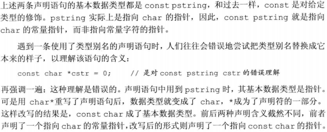

# 2.5 处理类型

## 2.5.1 类型别名
+ 使用关键字`typedef`定义类型别名
  > `typedef double wages;`  //wages是double的同义词  
  > `typedef wages base, *p;`  //base是double的同义词，p是double*的同义词

+ **别名声明**：使用关键字`using`作为别名声明的开始，其后紧跟别名和等号，作用是把等号左侧的名字规定成右侧类型的别名

+ 若类型别名指代复合类型或常量，用它声明变量会产生意想不到的后果
  > `typedef char *pstring;`  
  > `const pstring cstr = 0;`  //cstr是指向char的**常量指针**  
  > `const psting *ps;`  //ps是一个指针，它的对象是指向char的常量指针

## 2.5.2 auto类型说明符
+ auto让编译器通过初始值来推算变量的类型，显然，auto定义的变量必须有初始值

+ 使用auto也能在一条语句中声明多个变量，因为一条声明语句只能有一个基本数据类型，所以该语句中所有变量的初始基本数据类型必须一样
  > `auto i = 0, *p = &i;`  //正确：i是整数、p是整型指针  
  > `auto sz = 0, pi = 3.14;`  //错误：sz和pi的类型不一致

+ 引用被用作初始化时，真正参与初始化的是引用对象的值，此时编译器以引用对象的类型作为auto的类型
  > `int i = 0, &r = i;`
  > `auto a = r;`  //a是一个整数（r是i的别名，而i是一个整数）

+ auto一般会忽略掉顶层const，底层const会保留下来
  > `const int ci = i, &cr = ci;`  
  > `auto b = ci;`  //b是一个整数(ci的顶层const特性被忽略)  
  > `auto c = cr;`  //c是一个整数(cr是ci的别名，ci本身是一个顶层const)  
  > `auto d = &i;`  //d是一个整型指针  
  > `auto e = &ci;`  //e是一个指向整数常量的指针(对常量对象取地址是一种底层const)

+ 如果希望推断出的auto类型是一个顶层const，需要明确指出
  > `const auto f = ci;`  //ci的推演类型是int，f是const int

## 2.5.3 decltype类型指示符
+ 若希望从表达式的类型推断出要定义的变量的类型，但不想用该表达式的值初始化变量，新标准引入了第二种类型说明符`decltype`，它的作用是选择并返回操作数的数据类型
  > `decltype(f()) sum = x;`  //sum的类型就是函数的返回类型

+ `decltype`处理顶层const和引用的方式与auto有些许不同，若decltype使用的表达式是一个变量，则decltype返回该变量的类型(包括顶层const和引用在内)
  > `const int ci = 0, &cj = ci;`  
  > `decltype(ci) x = 0;`  //x的类型是const int  
  > `decltype(cj) y = x;`  //y的类型是const int&，y绑定到变量x  
  > `decltype(cj) z;`  //错误：z是一个引用，必须初始化

+ 若`decltype`使用的表达式不是一个常量，则`decltype`返回表达式结果对应的类型
  > `int i = 42, *p = &i, &r = i;`
  > `decltype(r+0) b;`  //正确：加法的结果是int，因此b是一个（未初始化的）int
  > `decltype(*p) c;`  //错误：表达式是解引用操作，则`decltype`将得到引用类型，则c是int&，必须初始化

+ `decltype((variable))`的结果永远是引用，而`decltype(variable)`结果只有当variable本身是一个引用时才是引用