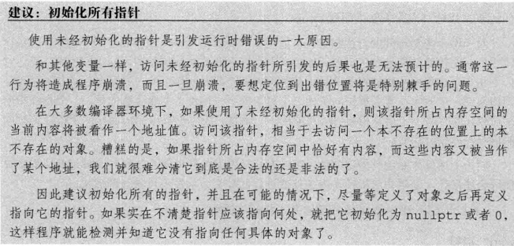
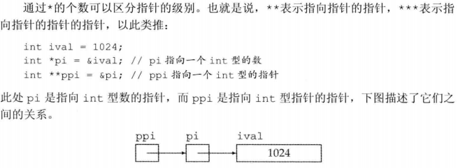
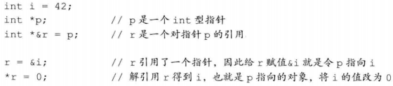

# 2.3 复合类型(基于其他类型定义的类型)

## 2.3.1 引用（为对象起了另外一个名字）
+ 一般在初始化变量时，初始值会被拷贝到新建对象中，然而定义引用时，程序将引用和它的初始值绑定在一起，而不是将初始值拷贝给引用（引用必须初始化，不能重新绑定）

+ 引用并非对象，它只是为一个已经存在的对象所起的另外一个名字，因此不能定义引用的引用

+ 引用只能绑定在对象上，而不能与字面值或某个表达式的计算结果绑定在一起

## 2.3.2 指针（指向另外一种类型的复合类型）
+ 指针本身就是一个对象，在生命周期内可先后指向不同对象，且无需在定义时赋初值，和其他内置类型一样，在块作用域内定义的指针若未初始化，也将拥有一个不确定的值

+ 指针存放某个对象的地址，要想获取该对象的地址，需要使用取地址符

+ 指针的值（即地址）应属于下列4种状态之一：
  1. 指向一个对象
  2. 指向紧邻对象所占空间的下一个位置
  3. 空指针
  4. 无效指针，上述情况之外的其他值
  > 试图拷贝或以其他方式访问无效指针的值都将引发错误

+ 空指针不指向任何对象，试图使用一个指针之前代码应该首先检查它是否为空

+ 几种生成空指针的方法：
    1. `int *p1 = nullptr`
    2. `int *p2 = 0`
    3. `int *p3 = NULL`  //需要包含`cstdlib`头文件

+ 把`int`变量直接赋给指针是错误的，即使`int`变量的值恰好等于0也不行

+ 对两个类型相同的合法指针，可以用相等(==)操作符或不相等(!=)操作符来比较它们，比较结果为布尔类型，如果两个指针存放的地址值相同，则它们相等，反之，它们不相等

+ void* 是一种特殊的指针类型，可用于存放任意对象的地址，不能直接操作void* 所指的对象，因为并不知道这个对象到底是什么类型，也就无法确定能在这个对象上做哪些操作。
  > 以void*的视角来看内存空间也就仅仅是内存空间，没有办法访问内存空间所存的对象

## 2.3.2 理解复合类型的声明
+ 定义多个变量
  1. 把空格写在类型修饰符和变量名中间虽然合法，但是容易产生误导
     > `int* p;`  //p是指向int的指针  
     > `int* p1, p2;`  //p1是指向int的指针，p2是int
  2. 一般把修饰符和变量标识符写在一起
     > `int *p1, *p2;`  //p1和p2都是指向int的指针

+ 指向指针的指针

+ 指向指针的引用
  1. 引用本身不是一个对象，因此不能定义指向引用的指针，但指针是对象，因此存在对指针的引用

  2. 要理解上图中`r`的类型是什么，最简单的方法是从右向左阅读`r`的定义，离变量名最近的符号(此例中是&)对变量的类型有最直接的影响，因此`r`是一个引用，声明符的其余部分用以确定`r`引用的类型是什么，此例中的符号*说明`r`引用的是一个指针，最后，声明的基本数据类型部分指出`r`引用的是一个int指针