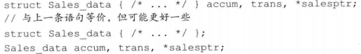

# 2.6 自定义数据结构

+ 以关键字`struct`开始，紧跟着类名和类体（类体部分可以为空），类体由花括号包围形成了一个新的作用域，类内部定义的名字必须唯一，但是可以与类外部定义的名字重复

+ 类体右侧的表示结束的花括号后必须写一个分号，因为类体后面可以紧跟变量名以示对该类型对象的定义，所以**分号必不可少**

+ 新标准规定可以为数据成员提供一个**类内初始值**，没有初始值的成员将被默认初始化

+ 为了保证各文件中类的定义一致，类通常被定义在头文件中，且类所在头文件的名字应与类的名字一样

+ 头文件通常包含那些只能被定义一次的实体，如类、const和constexpr变量

+ 预处理器是在编译之前执行的一段程序，可以部分地改变我们所写的程序
  1. `#include`，当预处理器看到`#include`标记时会用指定的头文件内容代替`#include`
  2. **头文件保护符**，`#define`指令把一个名字设定为预处理变量，另外两个指令分别检查某个指令处的预处理变量是否已经定义：`#ifdef`当且仅当变量已定义时为真，`#ifndef`当且仅当变量未定义时为真，一旦检查结果为真，后续执行操作直至遇到`#endif`指令为止