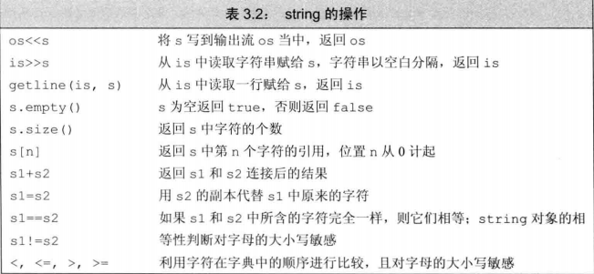
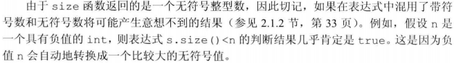
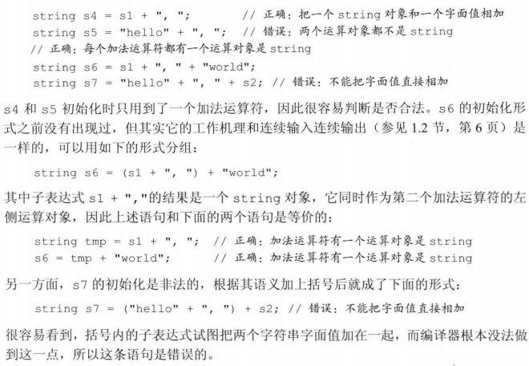
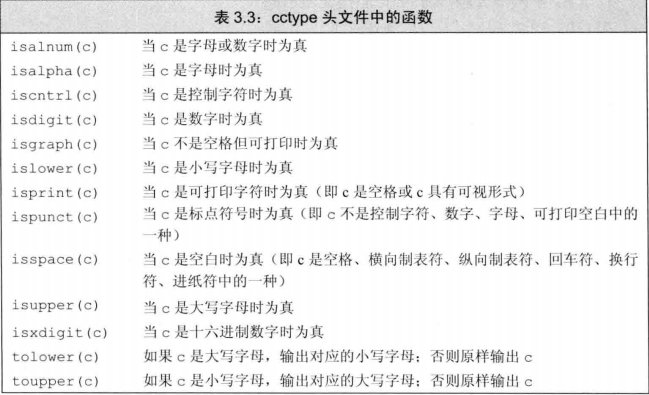
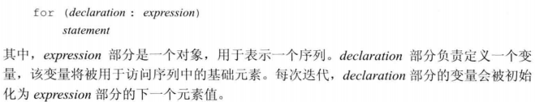
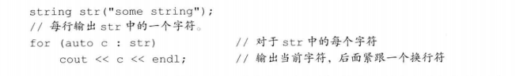
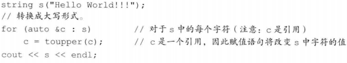
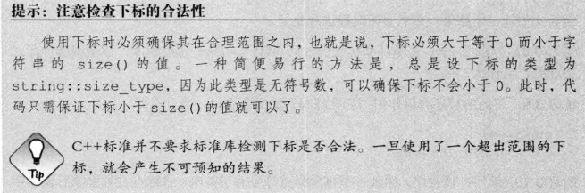

# 3.2 标准库类型string

## 3.2.1 定义和初始化`string`对象
+ 初始化`string`对象的方式
  1. `string s1;`  //默认初始化，s1是一个空串
  2. `string s2(s1);`  //s2是s1的副本
  3. `string s2 = s1;`  //等价于s2(s1)，s2是s1的副本
  4. `string s3("value");`  //s3是字面值"value"的副本，除了字面值最后那个空字符外
  5. `string s3 = "value";`  //等价于s3("value")
  6. `string s4(n, 'c');`  //把s4初始化为由连续n个字符c组成的串

+ **直接初始化和拷贝初始化：**使用等号(=)初始化一个变量，执行的是拷贝初始化，相反，如果不使用等号，执行的是直接初始化

## 3.2.2 `string`对象上的操作
+ 

+ `cin`读取操作时，`string`对象会自动忽略开头的空白（空格符、换行符、制表符等）并从第一个真正的字符开始读起，直到遇见下一处空白为止

+ 和内置类型的输入输出操作一样，`string`对象的输入输出操作也是返回运算符左侧的运算对象作为其结果，因此，可以将多个输入或多个输出连写在一起

+ 有时希望在最终得到的字符串中保留输入时的空白符，应用`getline`函数代替原来的`>>`运算符，其参数是一个输入流和一个`string`对象，函数从给定的输入流中读入内容，直到遇到换行符为止（换行符也会被读进来），然后把读取的内容存入到那个`string`对象中（**不存换行符**），若输入一开始就是换行符，所得结果是个空串

+ `size`函数返回的是一个`string::size_type`类型的值，它是一个无符号类型的值且能足够存放下任何`string`对象的大小

+ 新标准中允许编译器通过auto或decltype来推断变量的类型
  > `auto len = line.size();`  //len的类型是string::size_type

+ 如果一条表达式中已经有了size()函数就不要再使用int了，这样可以避免混用int和unsigned可能带来的问题

+ `string`对象相等意味着它们的长度相同而且所包含的字符也全部相同
  1. 如果两个`string`对象长度不同，且较短的每个字符都与较长的对应位置上的字符相同，就说较短的`string`对象小于较长的`string`对象
  2. 若两个`string`对象在某些对应位置上不一致，则`string`对象比较的结果其实是`string`对象中第一对相异字符比较的结果

+ 标准库允许把字符字面值和字符串字面值转换成`string`对象，当把`string`对象和字符字面值及字符串字面值混在一条语句中使用时，必须确保每个加法运算(+)两侧的运算对象至少有一个是`string`

## 3.2.3 处理`string`对象中的字符
+ 

+ 新标准提供一种**范围for**语句，可以遍历给定序列中每个元素并对序列中每个值执行某种操作

+ 若想改变`string`对象中字符的值，必须把循环变量定义为引用类型

+ 访问`string`对象中单个字符有两种方式
  1. 使用下标，**下标运算符([])**接收的输入参数是`string::size_type`类型的值，这个参数表示要访问字符的位置，返回值是该位置字符的引用
  2. 使用迭代器
