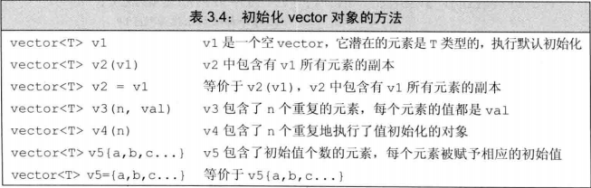
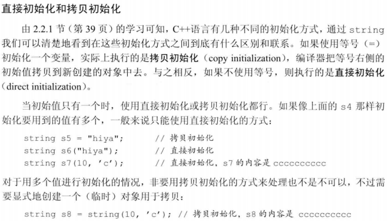
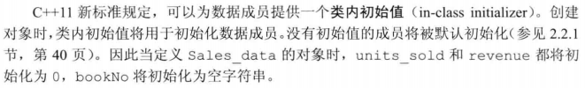
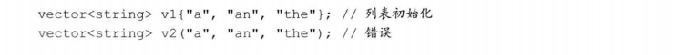

# 3.3 标准库类型vector

+ `vector`能容纳绝大多数类型的对象作为其元素，但因为引用不是对象，所以不存在包含引用的`vector`

## 3.3.1 定义和初始化`vector`对象
+ 

+ **列表初始化`vector`对象**：用花括号括起来的0个或多个初始元素值赋给`vector`对象

+ C++提供了几种不同的初始化方式，大多数情况下这些初始化方式可以相互等价使用，但是有几种例外情况：
  1. 使用拷贝初始化时只能提供一个初始值

  1. 如果提供的是一个类内初始值，则只能使用拷贝初始化或使用花括号的形式初始化

  3. 如果提供的是初始元素值的列表，则只能把初始值都放在花括号里进行初始化，而不能放在圆括号里

